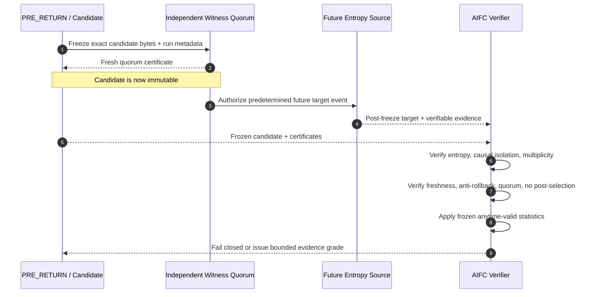

<div align="center">

# AIFC

### Auditable Independent-Future Challenge

**A proof-carrying, adversarial scientific protocol for testing claims of pre-existing information about independently generated future random events.**

[](LICENSE)
[](spec/AIFC-SPEC-v1.0-draft.md)
[](docs/EVIDENCE_GRADES.md)
[](docs/PRIOR_ART_BOUNDARY.md)
[](#scientific-boundary)

**Freeze first. Generate later. Audit everything.**

</div>

---

## The question

Suppose a researcher irreversibly records a 256-bit string today. Only after that record is externally certified, an independent physical or public randomness source generates a 256-bit target tomorrow.

If the two strings are identical, what would science need to establish before treating the event as anything more than coincidence, leakage, hidden pre-generation, post-selection, rollback, or fraud?

**AIFC exists to make that question auditable.**

It does not assume retrocausality. It defines a fail-closed evidence stack for testing a narrower claim:

> **Did an immutable pre-target witness contain exact information about a later independently generated random target beyond the admitted forward-causal guessing bound?**

---

## Protocol at a glance



The crucial ordering is:

```text
PRE_RETURN bytes exist
        ↓
external freeze / freshness certificate
        ↓
future target generation becomes eligible
        ↓
target is generated
        ↓
independent verification
```

A target that was generated, prefetched, committed from target-derived data, or otherwise causally available before the freeze is **not** an independent-future target under AIFC.

---

## Evidence stack

AIFC intentionally composes several established ideas into one operational protocol. A trial is not admitted merely because one layer passes.

| Gate | What it protects against | Required condition |
|---|---|---|
| **Exact pre-target freeze** | Editing after the fact | Candidate bytes fixed before target generation |
| **Post-freeze target generation** | Hidden pre-generation / prefetch | Target-producing event occurs only after freeze |
| **Conditional min-entropy** | Predictable or weak targets | Bound relative to the complete pre-target information set |
| **Causal isolation / d-separation** | Shared seeds, latent common causes, side channels | No admitted target-to-candidate information path or common-cause dependence |
| **Multiplicity accounting** | Many guesses disguised as one | Every frozen candidate slot enters the null bound |
| **No post-selection** | Choosing only impressive runs | Inclusion/reporting rule fixed before outcomes |
| **Anytime-valid evidence** | Optional stopping / continuous peeking | e-process or equivalent valid sequential test |
| **External freshness** | Snapshot rollback / replay | At least one freshness root outside the rollback domain |
| **Byzantine-safe witness quorum** | Split histories / colluding witnesses | Quorum derived from an explicit fault model |
| **Fail-closed verifier** | Semantic promotion by assertion | Missing evidence blocks admission rather than weakening the wording |

See [`spec/AIFC-SPEC-v1.0-draft.md`](spec/AIFC-SPEC-v1.0-draft.md) for the normative draft.

---

## Formal core

Let $\mathcal F_{i-1}$ be the complete information available before target $T_i$ is generated. Let $C_i$ be the set of candidate values irreversibly frozen before that target, with $|C_i|\le K_i$.

If the future-target source admits the history-wise bound

$$
\max_t \Pr(T_i=t\mid\mathcal F_{i-1}) \le p_i,
$$

then the per-trial exact-hit probability under the admitted forward null is bounded by

$$
a_i = \min(1,K_i p_i).
$$

For a bounded sequence of trials,

$$
\Pr(\exists i\le N:T_i\in C_i)
\le
1-\prod_{i=1}^{N}(1-a_i).
$$

For continuous monitoring, AIFC uses an anytime-valid test supermartingale / e-process. One simple factor is

$$
L_i=(1-\lambda_i)+\lambda_i\frac{X_i}{a_i},
\qquad
X_i=\mathbf 1[T_i\in C_i],
$$

with predictable $\lambda_i\in[0,1]$. Then

$$
E_n=\prod_{i=1}^{n}L_i
$$

is a nonnegative supermartingale under the admitted null, giving the Ville bound

$$
\Pr_0\!\left(\sup_n E_n\ge \frac1\alpha\right)\le\alpha.
$$

**Important:** the mathematics above is not claimed as new. The research claim under review is the end-to-end protocol composition and its evidence semantics.

---

## Why exact bits?

AIFC deliberately separates semantic similarity from hard identity.

A candidate may contain prose, images, or human interpretation for exploratory work, but the strongest gate compares frozen canonical bytes to future canonical bytes exactly. A typical hard witness may be constructed from independently specified fields such as a 128-bit payload plus a 128-bit nonce.

For a genuinely uniform 256-bit target with one frozen candidate, the one-shot guessing scale is

$$
2^{-256}\approx 8.64\times10^{-78}.
$$

Across one million preregistered opportunities, a simple union scale is approximately

$$
10^6\,2^{-256}\approx 8.64\times10^{-72},
$$

but AIFC does **not** permit this number to be quoted unless the required history-wise entropy and multiplicity premises are actually supported.

---

## Adversarial hardening already performed

The originating JANUS research line was used as a sandbox to attack the protocol before exposing it as a standalone methodology. The machine tests are evidence about verifier logic and stated mathematical models; they are **not physical evidence of retrocausality**.

| Test family | Result |
|---|---:|
| End-to-end evidence-gate assignments | **256 / 256 classified fail-closed** |
| Fail-open admission violations | **0** |
| Fair binary adaptive strategies | **32,768 checked, 0 bound violations** |
| Biased binary adaptive strategies | **32,768 checked, 0 bound violations** |
| Random history-wise target trees | **5,000 checked, 0 bound violations** |
| Anytime-valid adaptive betting policies | **2,187 fair + 2,187 biased, 0 Ville violations** |
| Causal-isolation parallel channel subsets | **128 / 128** |
| Temporal rollback/replay lab | **17 / 17** |
| Quorum configurations $n\le 8$ | **204 checked, 0 classification violations** |
| Unsafe quorum configurations | **134 / 134 explicit counterexamples constructed** |

The adversarial tests also produced concrete failures of weaker approaches, including:

- marginal entropy used as if it were history-wise conditional entropy;
- optional stopping with an invalid null cap;
- common hidden seed without any direct target-to-past path;
- collider/post-selection creating perfect apparent dependence;
- cryptographically valid but stale rollback snapshots;
- two locally valid conflicting histories;
- numerical majority quorums that are unsafe under Byzantine overlap.

---

## Quorum rule

With $n$ external witnesses, at most $f$ Byzantine witnesses, and honest witnesses refusing to certify conflicting heads at the same logical position, conflicting $q$-witness certificates are excluded when

$$
2q>n+f.
$$

Equivalently,

$$
q_{\min}=\left\lfloor\frac{n+f}{2}\right\rfloor+1.
$$

A practical baseline for the first external bench is **3-of-4** witnesses under an explicit $f=1$ model, provided they are genuinely distinct failure domains. Four processes on one rollbackable host do not count as four independent witnesses.

---

## Scientific boundary

> [!IMPORTANT]
> **AIFC does not report an observation of physical retrocausality, faster-than-light communication, closed timelike curves, precognition, or information transfer to the past.**

A threshold crossing under a fully admitted AIFC trial would mean only:

```text
THE SPECIFIED FORWARD-CAUSAL NULL
OR AT LEAST ONE OF ITS EVIDENCE PREMISES
IS INCOMPATIBLE WITH THE OBSERVED RECORD
```

It would **not** identify a physical mechanism by itself.

AIFC therefore distinguishes at least these levels:

```text
NOT_ADMITTED
STRUCTURAL_MATCH_ONLY
FORWARD_NULL_INCOMPATIBILITY_CANDIDATE
EXTERNAL_REPLICATION_REQUIRED
PHYSICAL_MECHANISM_UNRESOLVED
```

See [`docs/EVIDENCE_GRADES.md`](docs/EVIDENCE_GRADES.md).

---

## Repository map

```text
AIFC/
├── README.md
├── LICENSE
├── NOTICE
├── CITATION.cff
├── .zenodo.json
├── ROADMAP.md
├── CONTRIBUTING.md
├── SECURITY.md
│
├── spec/
│   └── AIFC-SPEC-v1.0-draft.md
│
├── docs/
│   ├── THREAT_MODEL.md
│   ├── EVIDENCE_GRADES.md
│   ├── PRIOR_ART_BOUNDARY.md
│   └── REPLICATION_GUIDE.md
│
├── reference/
│   └── README.md
│
├── test-vectors/
│   └── README.md
│
└── provenance/
    └── ORIGIN.json
```

---

## Current status

| Component | Status |
|---|---|
| Conceptual framework | **FORMULATED** |
| Classical exact-match / independent-future incompatibility result | **FORMULATED + MACHINE CHECKED** |
| Sequential history-wise bound | **FORMULATED + MACHINE CHECKED** |
| Anytime-valid e-process integration | **MACHINE HARDENED IN SANDBOX** |
| Causal d-separation gate | **MACHINE HARDENED IN SANDBOX** |
| Rollback / replay gate | **MACHINE HARDENED IN SANDBOX** |
| Byzantine quorum gate | **MACHINE HARDENED IN SANDBOX** |
| End-to-end evidence semantics | **256/256 GATE MATRIX PASS** |
| Standalone reference verifier | **PLANNED / NOT YET FROZEN** |
| External public-beacon bench | **NOT YET RUN** |
| Independent second implementation | **NOT YET RUN** |
| Physical retrocausal effect | **NOT OBSERVED** |
| Global scientific novelty | **NOT ESTABLISHED — composition-level candidate under review** |

---

## What would count as success?

AIFC is useful even if every physical trial is null.

A successful research program can produce any of the following:

1. a rigorous rejection of false future-information claims;
2. quantified evidence that an apparent hit is explained by entropy loss, leakage, multiplicity, post-selection, or rollback;
3. a reproducible null result under a strong external protocol;
4. a protocol flaw or counterexample that forces AIFC itself to be revised;
5. only in the strongest case, a replicated anomaly that remains incompatible with the admitted forward null after all evidence gates survive independent audit.

Negative results are first-class outputs.

---

## Reproduce / attack the protocol

Start with:

- [`AIFC SPEC v1.0 draft`](spec/AIFC-SPEC-v1.0-draft.md)
- [`Threat model`](docs/THREAT_MODEL.md)
- [`Evidence grades`](docs/EVIDENCE_GRADES.md)
- [`Prior-art boundary`](docs/PRIOR_ART_BOUNDARY.md)
- [`Replication guide`](docs/REPLICATION_GUIDE.md)
- [`Reference implementation status`](reference/README.md)
- [`Adversarial test-vector policy`](test-vectors/README.md)

The preferred contribution is not agreement. It is a **counterexample, exploit, missing side-information channel, invalid statistical premise, verifier bug, or independent replication**.

---

## Origin and provenance

AIFC emerged from the JANUS causal-consistency / independent-future research line and was separated into this standalone repository so that the protocol can be evaluated without accepting JANUS, Genesis, or any speculative physical interpretation.

The frozen provenance chain and earlier research artifacts are recorded in [`provenance/ORIGIN.json`](provenance/ORIGIN.json).

The original research line is attributed to **Alexander Agapov / Hawkar-usls**. Formalization and adversarial hardening were developed in collaboration with **OpenAI GPT-5.6 Sol**. Provenance identifies the development history; it does not establish scientific priority over all prior art.

---

## Citation

Until a DOI-backed release is published, cite the repository using [`CITATION.cff`](CITATION.cff).

Suggested form:

> Agapov, A. (2026). *AIFC — Auditable Independent-Future Challenge*. Research protocol and reference implementation. GitHub.

---

## License

Code, specifications, and repository materials are currently distributed under the [Apache License 2.0](LICENSE) unless a file explicitly states otherwise.

---

<div align="center">

### AIFC

**Extraordinary temporal claims should carry extraordinary provenance.**

`freeze → generate → verify → attack → preserve`

</div>
